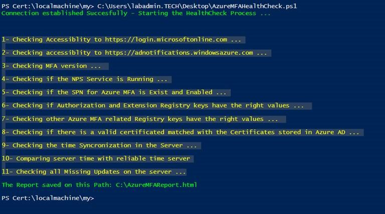
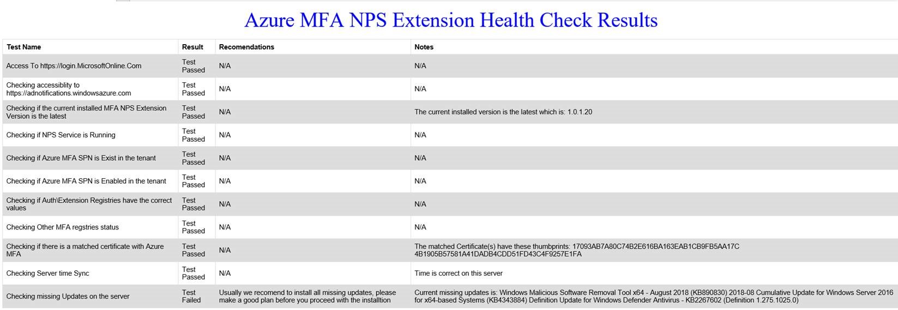

# Azure MFA NPS extension health check script

Script to run against Azure MFA NPS Extension servers to perform some basic checks to detect any issues.

Here's a quick summary about each available option when the script is run:
1. To isolate the cause of the issue: if it's an NPS or MFA issue (Export MFA RegKeys, Restart NPS, Test, Import RegKeys, Restart NPS)
1. To check a full set of tests, when not all users can use the MFA NPS Extension (Testing Access to Azure/Create HTML Report)
1. To check a specific set of tests, when a specific user can't use the MFA NPS Extension (Test MFA for specific UPN)
1. To collect logs to contact Microsoft support (Enable Logging/Restart NPS/Gather Logs). The output will be in HTML format.

## Script requirements

The script needs to be run as a user with local admin privilege on the server, and will ask for global admin on the tenant to be run against.

## How to run the script

Download and run the `MFA_NPS_Troubleshooter.ps1` script from this GitHub repo, by accessing **Browse Code** icon on top of this webpage, and then select **Download Zip** option, on green button **Code**.

When running script file, select one of the available options, based on what goal to achieve.

## What tests the script performs

Based on each option selection, performs the following test against MFA Extension Server:

**Option 1**:
1. Export the current registry keys for NPS Extension configuration
1. Restarts NPS Extension with empty registry keys
1. User performs simulation of current situation being checked
1. Import to current registry keys for NPS Extension configuration from previous backed up information
1. Restarts NPS Extension with configured registry keys

**Option 2**:
1. Check accessibility to https://login.microsoftonline.com
1. Check accessibility to https://adnotifications.windowsazure.com
1. Check accessibility to https://strongauthenticationservice.auth.microsoft.com
1. Check MFA version.
1. Check if the NPS Service is *Running*.
1. Check if the SPN for Azure MFA *Exists* and is *Enabled*.
1. Check if *Authorization* and *Extension* registry keys have the right values.
1. Check other Azure MFA related registry keys have the right values.
1. Check if there is a valid certificated matched with the certificates stored in Azure AD.

**Option 3**:
1. Check if user account *Exists* in Azure AD
1. Check if use is synched to Azure AD from On premises
1. Check if user is blocked on Azure AD or not
1. Check if user status is healthy in Azure AD
1. Check if user has completed MFA Proofup in Azure AD
1. Check if user has a valid license for MFA
1. Check user Dial-In status on local AD

**Option 4**:
1. Enable logging for NPS Extension feature and dependent services
1. Restart NPS Extension
1. User performs simulation of current situation being checked
1. When simulation ends, it will generate a ZIP file with all log files required

## How the results will be displayed when output to HTML (option 2)

In PowerShell console it will only display the tests name, then it will convert the result to HTML file located at `C:\AzureMFAReport.html`.

Example console output:

Example HTML output:

## Frequently asked questions

### In case the script detect some issues, will it fix then automatically?

No, but the script will suggest some remediation steps, as shown in the previous example HTML output.

### The script is not checking everything, right?

No, here I need your help! Feel free to share your ideas with me and we can work together to improve it. Open a GitHub issue or pull request in this repo.

### Do you think that the HTML design is cool?

No, help to make it better! Open a GitHub pull request in this repo with your improvements.

## Contributing

This project welcomes contributions and suggestions.  Most contributions require you to agree to a
Contributor License Agreement (CLA) declaring that you have the right to, and actually do, grant us
the rights to use your contribution. For details, visit https://cla.opensource.microsoft.com.

When you submit a pull request, a CLA bot will automatically determine whether you need to provide
a CLA and decorate the PR appropriately (e.g., status check, comment). Simply follow the instructions
provided by the bot. You will only need to do this once across all repos using our CLA.

This project has adopted the [Microsoft Open Source Code of Conduct](https://opensource.microsoft.com/codeofconduct/).
For more information see the [Code of Conduct FAQ](https://opensource.microsoft.com/codeofconduct/faq/) or
contact [opencode@microsoft.com](mailto:opencode@microsoft.com) with any additional questions or comments.
